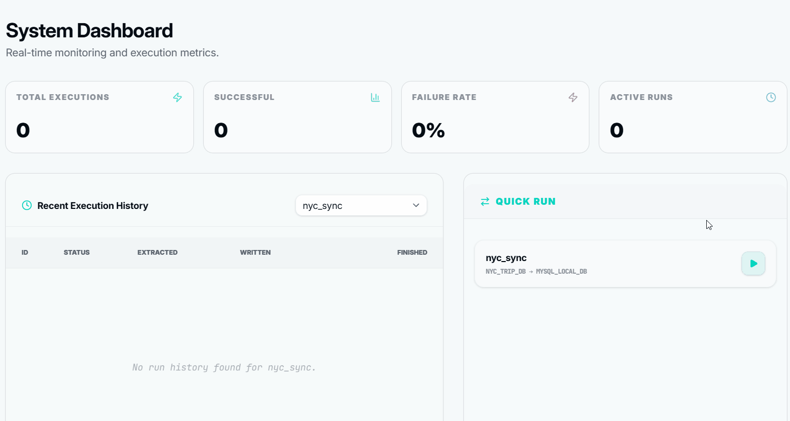
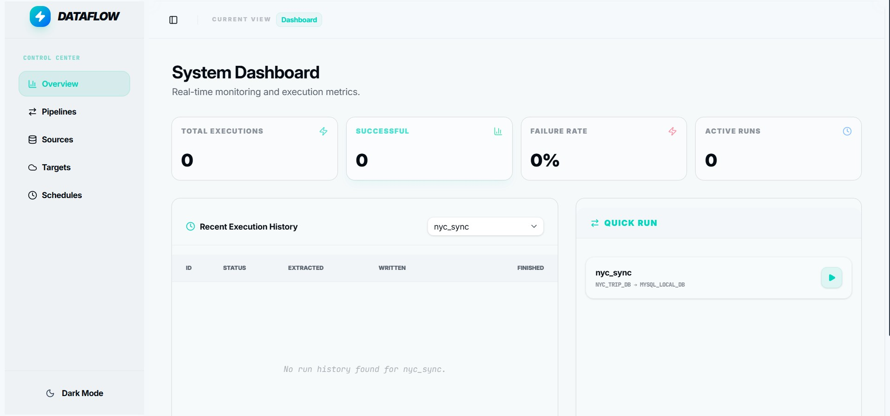
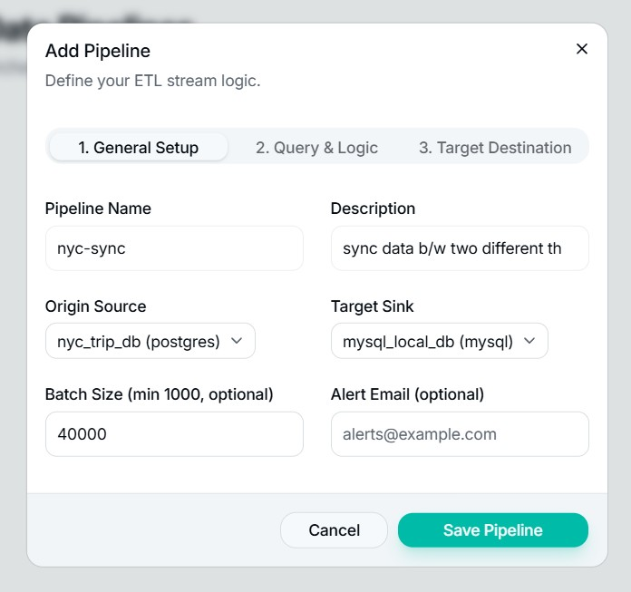
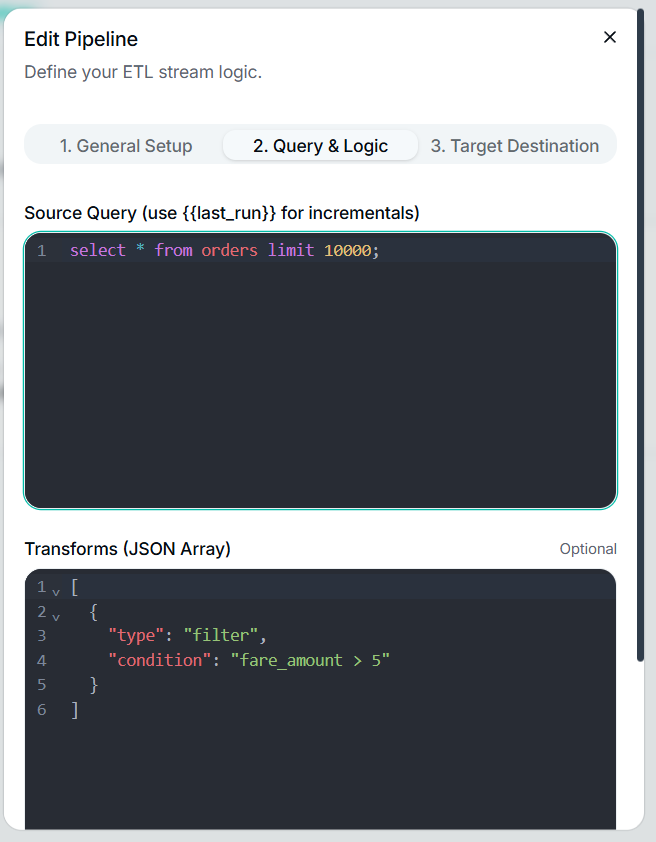
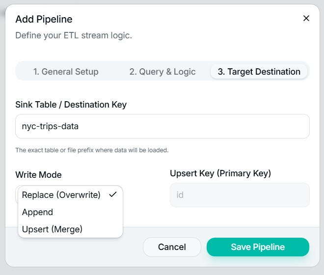
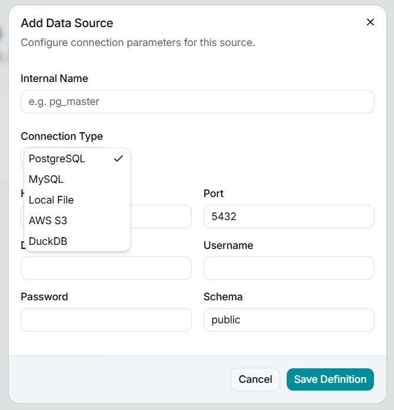
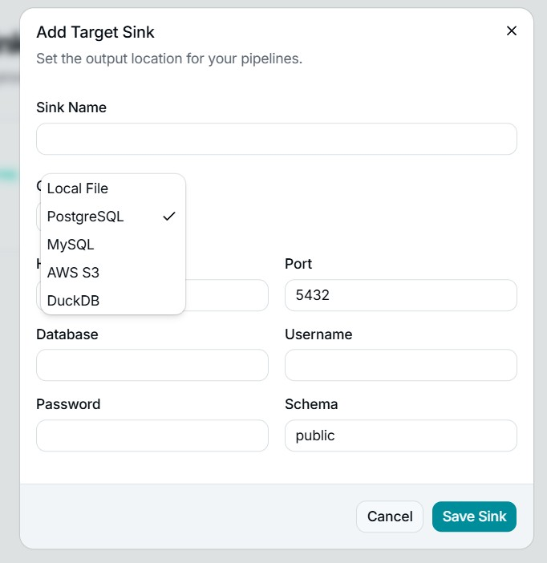

# Dataflow

> Stop writing ETL scripts. Automate your data pipelines with a UI.

Dataflow is a **self-hosted pipeline execution engine** with a dashboard. Connect your data sources, define where the data should go, set a schedule — Dataflow handles the rest automatically, with full visibility into every run.

No YAML files. No Airflow overhead. No cloud vendor lock-in. Runs on your machine or a $5 VPS.



---

## The Problem

Every growing company ends up with data scattered across MySQL, Postgres, S3, and CSV files. Someone writes a Python script to move it. It works — until it doesn't. Nobody knows when it breaks. Reports go stale. Engineers get paged at 2am.

Dataflow fixes this.

---

## What It Does

| Concept | What it means |
|---------|--------------|
| **Sources** | Where your data lives — PostgreSQL, MySQL, AWS S3, local CSV files |
| **Sinks** | Where data should go — DuckDB, Parquet files, PostgreSQL |
| **Pipelines** | The logic connecting a source to a sink — what query to run, how to transform it, how to write it (append / replace / upsert) |
| **Schedules** | Cron-based triggers that run pipelines automatically |
| **Dashboard** | A control tower — record counts, run status, success/failure history for every pipeline |

---

## Screenshots



### Creating a new pipeline
 
 


### Source Configurations


### Sink Configurations


---

## Quick Start

### Requirements

- Python 3.9+
- [uv](https://github.com/astral-sh/uv) (recommended) or pip

### Option 1 — Docker (easiest)

```bash
git clone https://github.com/vmskonakanchi/dataflow
cd dataflow
docker-compose up
```

Open `http://localhost:8000` for the UI.

### Option 2 — Manual

**Backend**

```bash
git clone https://github.com/vmskonakanchi/dataflow
cd dataflow

# Using uv (recommended)
uv sync
uv run fastapi dev dataflow/api/main.py

# Or using pip
pip install -e .
fastapi dev dataflow/api/main.py
```

**Frontend**

```bash
cd ui
npm install
npm run dev
```

Open `http://localhost:5173` in your browser.

---

## Tech Stack

| Layer | Technology |
|-------|-----------|
| Backend | FastAPI (Python) |
| Frontend | React + Vite + TypeScript |
| UI Components | shadcn/ui |
| Scheduling | APScheduler |
| Config DB | SQLite |
| Supported Sources | PostgreSQL, MySQL, AWS S3, CSV |
| Supported Sinks | DuckDB, Parquet, PostgreSQL, MySQL, AWS S3 |

---

## Project Structure

```
dataflow/
├── main.py                  # Entry point
├── dataflow/
│   ├── api/routes/          # FastAPI route handlers
│   │   ├── pipelines.py
│   │   ├── sources.py
│   │   ├── sinks.py
│   │   ├── cronjobs.py
│   │   └── system.py
│   ├── connectors/          # Source + sink connectors
│   │   ├── postgres.py
│   │   ├── mysql.py
│   │   ├── s3_connector.py
│   │   ├── duckdb_connector.py
│   │   └── csv_connector.py
│   ├── executor/            # Pipeline runner
│   ├── scheduler/           # Cron job engine
│   ├── transforms/          # Data transformations
│   └── config/              # DB models + config
└── ui/                      # React + Vite frontend
    └── src/
```

---

## Roadmap

- [x] PostgreSQL, MySQL, S3, CSV sources
- [x] DuckDB, Parquet, PostgreSQL sinks
- [x] Cron-based scheduling
- [x] Pipeline run history + record count dashboard
- [x] Append / replace / upsert load strategies
- [ ] Docker / docker-compose setup *(in progress)*
- [ ] Built-in query editor to inspect pipeline output
- [ ] Real-time pipeline status updates
- [ ] Slack alerts on pipeline failure
- [ ] More connectors — MongoDB, Snowflake, BigQuery, Kafka
- [ ] Webhook triggers

---

## Who This Is For

- **Small data teams** tired of maintaining fragile ETL scripts
- **Freelance data consultants** managing pipelines across multiple clients
- **Startups** that need reliable data movement without a dedicated data engineer

---

## Status

Early but working. Core pipeline engine, scheduling, and dashboard are production-tested. Looking for teams currently stitching this together manually — if that's you, open an issue or reach out. Happy to help you set it up.

**[contact@vamsi-k.com](mailto:contact@vamsi-k.com)**

---

## License

[Business Source License 1.1 (BUSL-1.1)](./LICENSE)

Free to self-host and use internally. Commercial resale requires a separate license. Converts to Apache 2.0 on [4 years from release date].