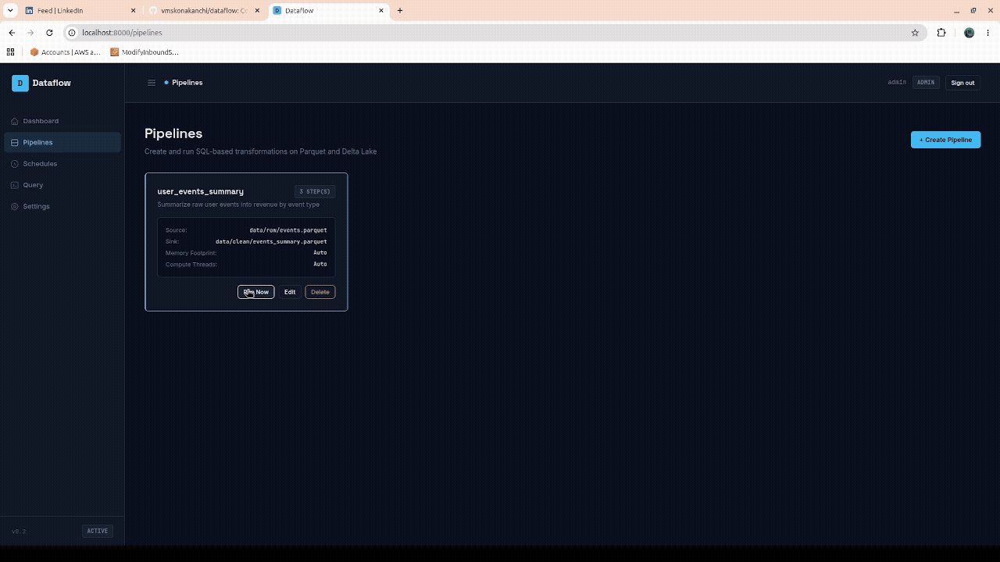

# Dataflow

> Self-hosted data pipeline engine built on DuckDB — with a dark-mode dashboard, SQL transforms, Delta Lake writes, and built-in data quality checks.

---

  

---

## Table of Contents

- [Why Dataflow](#why-dataflow)
- [What It Does](#what-it-does)
- [Tech Stack](#tech-stack)
- [Quick Start](#quick-start)
  - [Docker (Recommended)](#docker-recommended)
  - [Local Development](#local-development)
- [SQL Transformation Pipeline Compiler](#sql-transformation-pipeline-compiler)
- [Python Transform Plugins](#python-transform-plugins)
- [Built for Production](#built-for-production)
- [Roadmap](#roadmap)
- [License](#license)

---

## Why Dataflow

Most data pipeline tools make you choose between simplicity and power. Lightweight scripts break at scale. Heavy platforms like Airflow or Databricks require JVM clusters, managed infrastructure, and significant ops overhead just to get started.

Dataflow sits in between:

| | Cron scripts | Airflow | Databricks | **Dataflow** |
|---|:---:|:---:|:---:|:---:|
| No infrastructure to manage | ✅ | ❌ | ❌ | ✅ |
| Web dashboard | ❌ | ✅ | ✅ | ✅ |
| Data quality checks | ❌ | ❌ | ✅ | ✅ |
| Delta Lake / atomic writes | ❌ | ❌ | ✅ | ✅ |
| Runs on a single machine | ✅ | ❌ | ❌ | ✅ |
| Self-hosted, no vendor lock-in | ✅ | ✅ | ❌ | ✅ |

**In short:** you get the reliability features of an enterprise platform with the simplicity of running a Python process. No JVM, no Kafka, no Zookeeper. Processes double-digit terabytes of Parquet data on a single machine via DuckDB's out-of-core execution.

---

## What It Does

| Concept | Description |
|---------|-------------|
| **Pipelines** | Mappings connecting source files (Parquet, JSON, CSV — local or S3) to a destination file or Delta table. |
| **SQL Transforms** | Sequential `select`, `filter`, `aggregate`, and `join` steps compiled into a single optimised DuckDB CTE. |
| **Data Quality** | Built-in checks (`not_null`, `unique`, `row_count_min`, `accepted_values`) and custom SQL assertions that run before every write. Bad data never hits the sink. |
| **Schedules** | Cron-based triggers that execute pipelines automatically with configurable retry logic. |
| **Dashboard** | A control tower showing total runs, success/failure rate, duration, and row metrics — with an ad-hoc SQL query tool built in. |

---

## Tech Stack

| Layer | Technology |
|-------|-----------|
| **Compute Engine** | DuckDB (vectorized, out-of-core) |
| **Storage** | Parquet + Delta Lake |
| **API Backend** | FastAPI (Python) |
| **Frontend UI** | Jinja2 + HTMX + Alpine.js — no npm, no build step |
| **Scheduling** | APScheduler |
| **Config DB** | SQLite (via SQLModel) |

---

## Quick Start

### Docker (Recommended)

The fastest way to get running — no Python environment needed.

1. Build the image:
   ```bash
   docker build -t dataflow:latest .
   ```

2. Start the application server:
   ```bash
   docker run --rm \
     -p 8000:8000 \
     -v $(pwd)/data:/app/data \
     -v $(pwd)/db:/app/db \
     dataflow:latest
   ```

   Open `http://localhost:8000` in your browser to access the dashboard.

### Local Development

#### Requirements

* Python 3.13+
* [uv](https://github.com/astral-sh/uv) (recommended) or pip

#### Setup & Installation

1. Clone the repository and sync the virtual environment:
   ```bash
   git clone https://github.com/vmskonakanchi/dataflow
   cd dataflow
   uv sync
   ```

2. Start the web server:
   ```bash
   uv run python main.py server --reload
   ```
   Open `http://localhost:8000` to access the dashboard.

That's the only command you need. Database migrations run on startup, the cron
scheduler runs in-process, and the job worker is spawned and supervised as a
separate process (so a heavy pipeline can't affect the web server) — all
automatically, with no extra setup or manual background processes.

---

## SQL Transformation Pipeline Compiler

Each pipeline compiles its sequence of SQL transforms into a single unified DuckDB COPY query. For example, a pipeline with a `select` and a `filter` step compiles to:

```sql
COPY (
  WITH raw_src AS (
    SELECT * FROM read_parquet('data/raw/*.parquet')
  ),
  step_0 AS (
    SELECT event_id, LOWER(email) AS email, CAST(revenue AS DOUBLE) AS revenue FROM raw_src
  ),
  step_1 AS (
    SELECT * FROM step_0 WHERE email IS NOT NULL AND revenue > 0.0
  )
  SELECT * FROM step_1
) TO 'data/clean/cleaned.parquet' (FORMAT 'PARQUET');
```

This executes out-of-core directly inside DuckDB — constant RAM footprint regardless of file size, from 10 MB to 10 TB.

---

## Python Transform Plugins

SQL transforms cover `select`/`filter`/`aggregate`/`join`, but some steps can't be expressed in SQL — dimensionality reduction (UMAP), clustering (HDBSCAN), calling a model, or any custom vector/dataframe logic. For these, Dataflow has a **plugin system**: drop a Python file into `src/transforms/`, and it becomes a selectable transform step.

### How it works

A plugin is a single `.py` file in `src/transforms/` that exposes one function:

```python
# src/transforms/my_plugin.py
import pyarrow as pa

def transform(table: pa.Table, params: dict) -> pa.Table:
    # `table`  – the current pipeline data (a PyArrow Table)
    # `params` – the params dict from the pipeline config
    # return a PyArrow Table; it replaces the data for the next step
    return table
```

Plugins are **discovered by name at runtime**. A pipeline step references one via:

```json
{ "type": "python", "function": "my_plugin", "params": { "column": "embedding" } }
```

At execution, the engine materializes the current data to an in-memory Arrow table, calls your `transform()`, then registers the result back into DuckDB so subsequent SQL steps continue normally.

> **Security note:** a plugin runs arbitrary Python with the server's privileges. Only add plugins you trust. The database only ever stores a plugin *name* (never code), so pipelines can't inject code — they can only select from the files you've vetted.

### Adding a plugin

1. Create a file in `src/transforms/`, e.g. `src/transforms/round_prices.py`:

   ```python
   import pyarrow as pa
   import pyarrow.compute as pc

   def transform(table: pa.Table, params: dict) -> pa.Table:
       column = params.get("column", "price")
       digits = int(params.get("digits", 2))
       rounded = pc.round(table.column(column), ndigits=digits)
       idx = table.schema.get_field_index(column)
       return table.set_column(idx, column, rounded)
   ```

2. That's it — **no restart needed** to add a *new* file. It's discovered live and appears in the pipeline builder's transform dropdown. (Editing an *existing* plugin does require a restart, since Python caches imported modules.)

3. In the UI: **Pipelines → Create/Edit → Transforms → `+ Python`**, pick your plugin from the dropdown, and supply params as JSON. Or set it directly in the pipeline config:

   ```json
   { "type": "python", "function": "round_prices", "params": { "column": "price", "digits": 2 } }
   ```

### The contract

| Rule | Detail |
|------|--------|
| File location | `src/transforms/<name>.py` (name must match `^[a-z][a-z0-9_]*$`) |
| Function | Module-level `transform(table, params)` |
| Input | `table`: `pyarrow.Table`, `params`: `dict` from the config |
| Output | Must return a `pyarrow.Table` (validated at runtime) |
| Errors | Anything raised surfaces as a clear pipeline failure at that step |
| Memory | In-process by default (whole table in RAM). Set `chunk_rows: N` on the step for memory-safe chunked execution (see below) |

### Example plugins

No plugins ship by default — you add the ones you need. Here are two common examples you can drop into `src/transforms/`.

**`normalize_embedding`** — L2-normalizes a `list<float>` embedding column (numpy only, no extra deps):

```python
# src/transforms/normalize_embedding.py
import numpy as np
import pyarrow as pa

def transform(table: pa.Table, params: dict) -> pa.Table:
    column = params.get("column", "embedding")
    out = []
    for vec in table.column(column).to_pylist():
        if not vec:
            out.append(vec); continue
        arr = np.asarray(vec, dtype=np.float32)
        n = np.linalg.norm(arr)
        out.append((arr / n).tolist() if n > 0 else arr.tolist())
    idx = table.schema.get_field_index(column)
    return table.set_column(idx, column, pa.array(out, type=pa.list_(pa.float32())))
```

```json
{ "type": "python", "function": "normalize_embedding", "params": { "column": "embedding" } }
```

**`umap_reduce`** — reduces an embedding column to N dimensions with UMAP, emitting `spatial_0 … spatial_{N-1}` columns (requires the optional `ml` extra — `umap-learn`, install with `uv sync --extra ml`):

```python
# src/transforms/umap_reduce.py
import numpy as np
import pyarrow as pa

def transform(table: pa.Table, params: dict) -> pa.Table:
    import umap
    matrix = np.asarray(table.column(params.get("column", "embedding")).to_pylist(), dtype=np.float32)
    n_dims = int(params.get("n_dims", 20))
    coords = umap.UMAP(n_components=n_dims,
                       n_neighbors=int(params.get("n_neighbors", 30)),
                       min_dist=float(params.get("min_dist", 0.0))).fit_transform(matrix)
    for d in range(n_dims):
        table = table.append_column(f"spatial_{d}", pa.array(coords[:, d].astype(np.float32)))
    return table
```

```json
{ "type": "python", "function": "umap_reduce",
  "params": { "column": "embedding", "n_dims": 20, "n_neighbors": 30, "min_dist": 0.0 } }
```

### A complete mixed pipeline

SQL extraction → Python ML step → SQL projection compose seamlessly:

```json
{
  "transforms": [
    { "type": "filter", "condition": "category = 'classification'" },
    { "type": "select", "columns": ["id", "embedding", "conversation_id"] },
    { "type": "python", "function": "normalize_embedding", "params": { "column": "embedding" } },
    { "type": "python", "function": "umap_reduce", "params": { "column": "embedding", "n_dims": 20 } },
    { "type": "select", "columns": ["id", "conversation_id", "spatial_0", "spatial_1"] }
  ]
}
```

### Important: memory & isolation

SQL transforms stream out-of-core (constant RAM). **Python plugins do not** — by default the step loads its input fully into memory, because operations like UMAP/HDBSCAN need the whole dataset at once. Plugins run inside the **isolated worker process**, so a memory-heavy or crashing plugin can't take down the web server.

#### Chunked execution (memory-safe for large partitions)

When a plugin's input is too big to fit in RAM — or when it parses JSON / builds large embedding arrays, whose memory DuckDB's `memory_limit` **cannot** bound — set `chunk_rows` on the step:

```json
{ "type": "python", "function": "my_heavy_plugin",
  "params": { "threshold": 0.7 },
  "chunk_rows": 12000 }
```

With `chunk_rows > 0`, the engine streams the step's input to a temporary Parquet file (constant RAM), then processes it in bounded row-slices — **each slice in a fresh subprocess that exits when done**. Because the OS reclaims all of a process's memory on exit (including allocations `memory_limit` can't track), peak memory stays bounded to a single chunk no matter how large the dataset is. Chunks run sequentially and their outputs are stitched back together transparently, so downstream SQL steps continue unchanged.

- `chunk_rows: 0` (default) — run in-process on the whole table (fastest; working set must fit in RAM).
- `chunk_rows: N` — process `N` rows per chunk in isolated subprocesses (bounded memory; ideal for large days or JSON/embedding-heavy plugins).

Your plugin code does **not** change — chunking is purely an engine concern. Note: for the slices to stitch cleanly, a plugin must emit the **same output schema for every chunk**.

You can still also **partition your pipeline** (e.g. process one day at a time); `chunk_rows` bounds memory *within* a single run.

---

## Built for Production

Dataflow is designed to fail safely, recover automatically, and never produce corrupt output.

| Failure scenario | Without Dataflow | With Dataflow |
|-----------------|-----------------|---------------|
| Source file missing | Runs for minutes, fails deep in execution | Fails in <1s with a clear error |
| Crash during write | Corrupt partial output file | Old version untouched (Delta atomic commit) |
| Pipeline fails at step 4 of 5 | Full restart from step 1 | Resumes from step 4 checkpoint |
| Server restarted mid-run | Corrupt output + lost progress | Clean exit, checkpoint saved, resumes next run |
| Scheduler triggers twice | Duplicate rows in output | Partition overwrite = same result |
| Network blip on S3 | Pipeline failure, manual re-run needed | Auto-retry after configurable delay |
| Output has 0 rows (upstream broke) | Silent — looks successful | Row count alert fires immediately |

---

## Single Sign-On (SSO)

Dataflow supports **OIDC single sign-on** (built and tested against **Microsoft Entra ID**), sitting *alongside* local username/password login — it never replaces it. Local accounts always keep working as a fallback.

**How it works**

- Users click **Sign in with Microsoft** on the login page and authenticate with your identity provider (Authorization Code flow, ID token validated via the provider's JWKS).
- On first login a local user record is auto-provisioned (configurable). The user's Entra **group/role claim** is mapped to a Dataflow RBAC role, and that role is **refreshed from the IdP on every sign-in** — so group membership stays the source of truth.
- Users in no mapped group get the configured default role, or are denied if no default is set.

**Enable it** (Settings → Single Sign-On, admin only):

| Setting | Notes |
|---|---|
| `sso_enabled` | Turn the button on/off |
| `sso_discovery_url` | Entra: `https://login.microsoftonline.com/<tenant-id>/v2.0/.well-known/openid-configuration` |
| `sso_client_id` / `sso_client_secret` | From the app registration |
| `sso_redirect_uri` | Blank = auto-derived as `<your-url>/auth/sso/callback` |
| `sso_group_claim` | Claim carrying group IDs (Entra: `groups` or `roles`) |
| `sso_group_role_map` | JSON, e.g. `{"<entra-group-id>": "editor", "<group-id>": "admin"}` |
| `sso_default_role` | Role for unmapped users; blank = deny |

**What to request from your identity/IT team (Entra app registration):**

- A **web app registration** with a **redirect URI** of `https://<your-dataflow-host>/auth/sso/callback`
- A **client secret** (and the application/client ID + directory/tenant ID)
- **ID token** issuance with the **groups claim** enabled (or app roles), so group→role mapping works
- Delegated `openid`, `email`, `profile` scopes

Until the corporate app registration is provisioned, SSO can be validated against any OIDC provider (a dev Entra tenant or a local mock) — it's standard OIDC, not Entra-specific.

---

## Roadmap

See [ROADMAP.md](./ROADMAP.md) for what has been shipped and what is coming next.

---

## Contributing

Contributions are welcome. See [CONTRIBUTING.md](./CONTRIBUTING.md) for local
setup, the branch and merge-request workflow, database-migration guidance, and
the plugin contract. Notable changes are recorded in [CHANGELOG.md](./CHANGELOG.md).

---

## License

[Apache License 2.0](./LICENSE) — free and open source. You may use, modify, and distribute it (including commercially), subject to the terms of the license.
