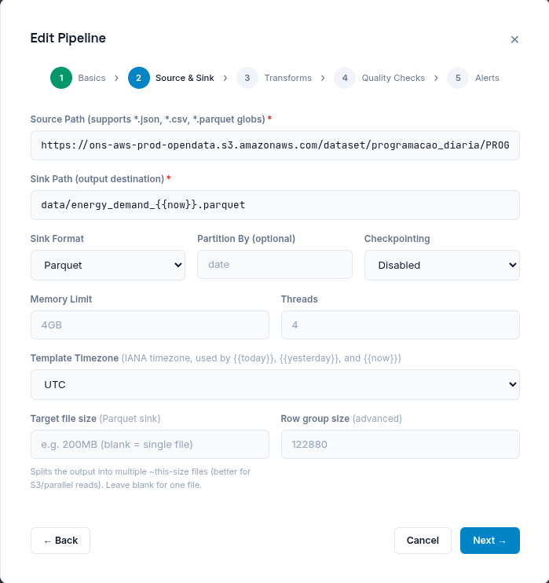
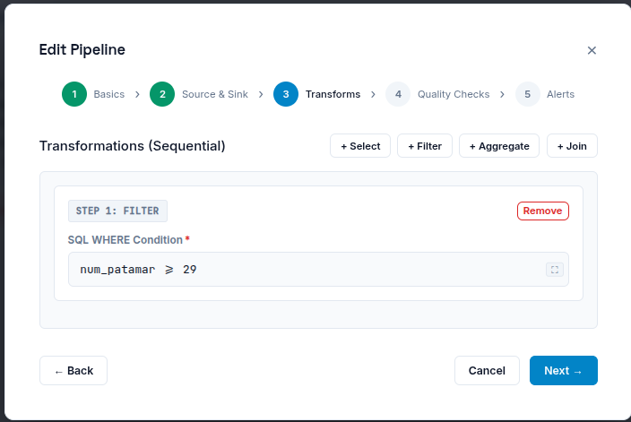
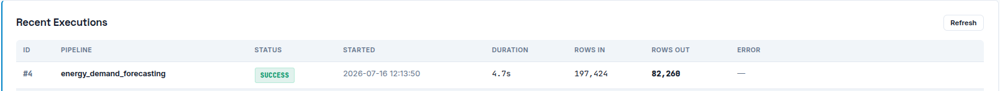

# Energy Demand Forecasting

This reference pipeline prepares a daily dataset published by the Brazilian
National Grid Operator (ONS) for downstream energy-demand analysis or
forecasting. It demonstrates a dated HTTPS source, pipeline template variables,
a SQL filter, and a dated Parquet sink.

> This example prepares data for a forecasting workflow. It does not train or
> serve a forecasting model.

## What It Demonstrates

- HTTPS Parquet source
- `{{today:%Y_%m_%d}}` URL resolution
- A pipeline timezone
- SQL filtering with DuckDB
- A dated Parquet output

## Configure the Pipeline

Create the pipeline in the Dataflow UI with these values:

| Field | Value |
| --- | --- |
| Name | `energy_demand_forecasting` |
| Source path | `https://ons-aws-prod-opendata.s3.amazonaws.com/dataset/programacao_diaria/PROGRAMACAO_DIARIA_{{today:%Y_%m_%d}}.parquet` |
| Sink path | `data/energy_demand_{{now}}.parquet` |
| Sink format | `Parquet` |
| Pipeline timezone | `UTC` |

Add one filter transformation:

```sql
num_patamar >= 29
```

Run the pipeline from **Pipelines -> Run Now**. The source template is
resolved before execution. For example, on 16 July 2026 the source path
becomes:

```text
https://ons-aws-prod-opendata.s3.amazonaws.com/dataset/programacao_diaria/PROGRAMACAO_DIARIA_2026_07_16.parquet
```

## Timezone Behavior

This example uses `UTC`, which is also Dataflow's default pipeline timezone.
`{{today}}`, `{{yesterday}}`, and `{{now}}` are resolved using that pipeline
timezone. If the dataset publisher uses a different calendar boundary, select
the matching IANA timezone for both the pipeline and its schedule.

## Screenshots

### Source, Sink, and Timezone



### SQL Transformation



### Successful Execution



The captured run read **197,424 rows**, wrote **82,260 rows**, and completed
in **4.7 seconds**.

## Next Steps

- Add a schedule with the same timezone as the pipeline.
- Add data-quality checks before writing the sink.
- Use the Parquet output as input to a separate forecasting or analytics workflow.
